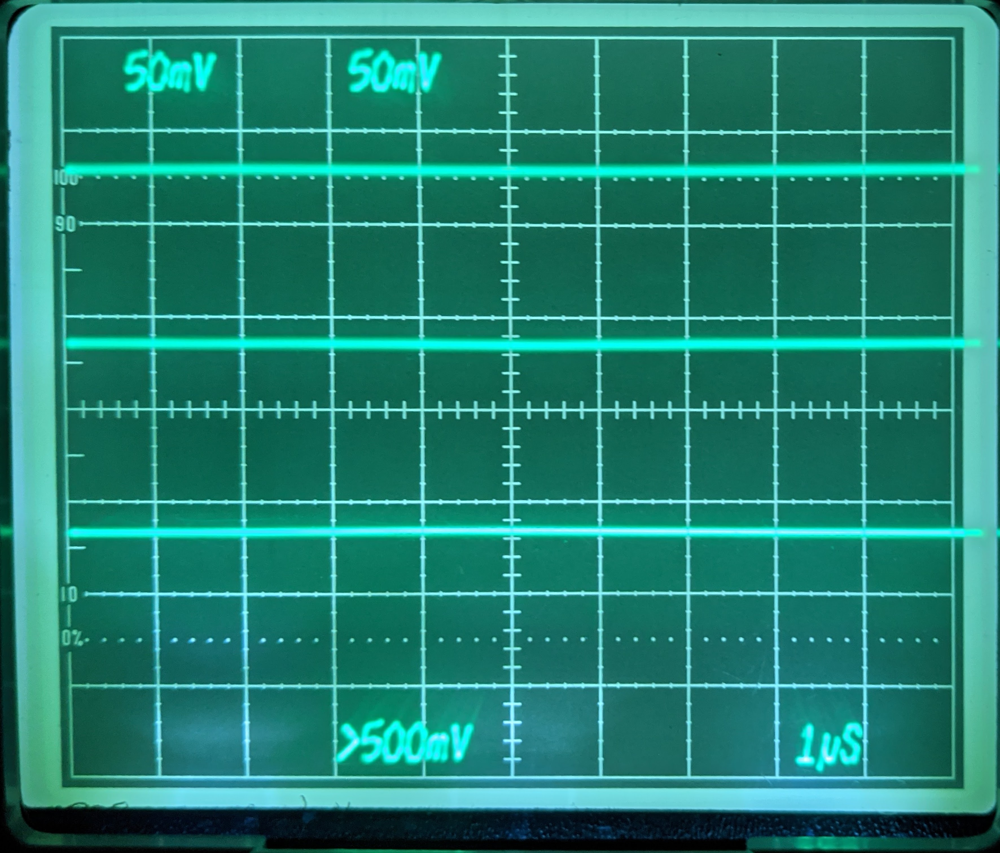

# Tek7904ALedGraticule
A project to retro-fit LED graticule lighting to Tektronix 7904A scopes.

Inspired by the white LED upgrade to a [Tek 7854 by Zenwizard Studios](https://youtu.be/GYkjuE7Pez8).

The 7904A is not so so straightforward that you can simply replace the lamps with LEDs and a series resistor.

This design replaces the existing incandescent graticule intensity control with a variable current source, all the existing controls are honoured, including intensity, gate and manual modes.

## [Schematic](V3.pdf)

## [BOM](BOM.md)

## Eagle Files
### [Schematic](V3.sch)
### [Board](V3.brd)

## ORder Boards
You can order multiples of three boards directly from [OSHpark](https://oshpark.com/shared_projects/jouvs37V)

# Licence
All work here is covered by the MIT Licence, which is simple and permissive.

TODO:
* circuit description
* assembly and installation instructions with photos
