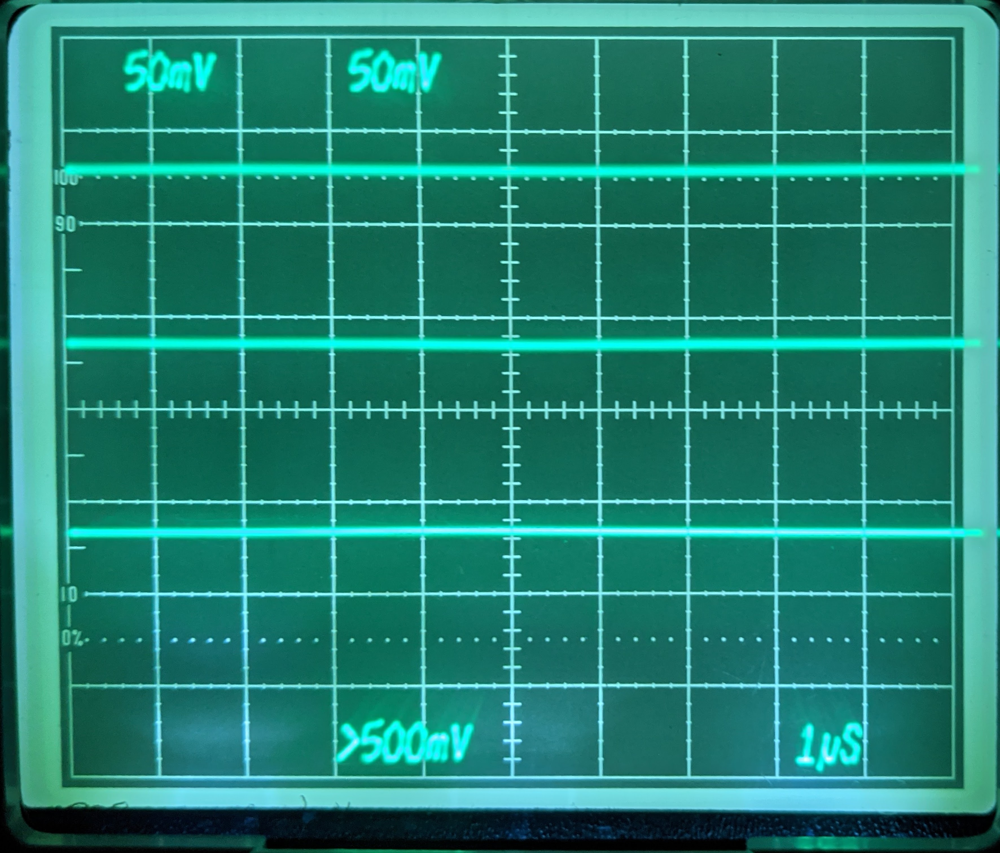

# Tek7904ALedGraticule
A project to retro-fit LED graticule lighting to Tektronix 7904A scopes.

Inspired by the white LED upgrade to a [Tek 7854 by Zenwizard Studios](https://youtu.be/GYkjuE7Pez8).

The 7904A is not so so straightforward that you can simply replace the lamps with LEDs and a series resistor.

This design replaces the existing incandescent graticule lamp driver circuit with a variable current source, all the existing controls are honoured, including intensity, gate and manual modes.

This upgrade is also featured at the beginning of Zenwizard Studios video: [Tektronix 7904A Lab Check in and LED MOD](https://youtu.be/GQn0EqW-u74).

## Theory of Operation
The 7904A controls the graticule illumination by means of circuitry on the A1 PCB (front panel board, located upper right front of scope.) This control circuit is documented on schematic 7 of my version of the manual (R1900, R1902, Q1910, S1905, S1910, etc.) Ultimately these various mechanisms result in a single -15V to 0V output signal on pin 4 of P1917; where -15V is illumination off, and 0V is full brighness.

This signal is then whisked off to the A22 PCB (LV Regulator board, located towards the rear.) The control signal is used by Q144, Q148 and associated components (schematic 15 in my version of the manual) to control a 0v to 6V output that is fed to the lamps via the A1 PCB again and a beefy pull-up resistor to +15V (R301.) The original lamps are wired in parallel, as shown on schematic 2.

The replacement re-uses all the control circuitry, so behaviour is identical, including all the modes and controls such as preset brightness, gated, and manual operation. However, it uses the -15V to 0V control voltage to control a 0 - 20mA current from the +15V rail through the replacement LEDs, which are wired in series. The circuit uses a simple emitter follower (T1) to convert the control voltage into a current sink, and a [Wilson current mirror](https://en.wikipedia.org/wiki/Wilson_current_mirror) (T2,3,4) to convert that into a current source to ground for the LEDs. It seemed apt, since George Wilson was a Tek engineer when he developed the eponymous circuit. The absolute accuracy of the mirror is not too important; so unmatched, discrete, transistors are used.

This is accomplished by inserting a small circuit with the additional electronics in the existing ribbon cable connection between the A1 and A22 boards. The control signal to, and the lamp power from, A22 are disconnected and no longer passed through. The pull-up resistor (R301 on A1) is removed.

The graticule light board (A30) is modified to replace the lamps with wide angle white LEDs,and to wire them in series.

## [Schematic](V3.pdf) (pdf)

## [BOM](BOM.md)

## Eagle Files
* [Schematic](V3.sch)
* [Board](V3.brd)

## Gerber Files
Here are generated gerbers, so you can use your PCB house of choice.
Note that I have only checked these with a viewer, I ordered my boards direct from OSHPark using the eagle board file. Send feedback if you use these files and they work or don't work.
* [Gerber zipfile](V3_gerbers.zip)

## Order Boards
You can order multiples of three known good boards directly from [OSHpark](https://oshpark.com/shared_projects/jouvs37V)

## Installation
There are four simple steps required in addition to making the circuit board (all obviously accomplished with the scope off, and fully discharged):
1. Reworking the graticule light board (A30.)
First remove the graticule lamp assembly from the scope, this is accomplished as follows:
    1. [Remove the plastic trim around the CRT](images/PXL_20220108_233952439.jpg), by gently pulling it away from the screen.
    2. [Loosen the two screws holding the retaining clips](images/PXL_20220108_234001968.jpg) for the tinted filter, and rotate the clips out of the way.
    3. Remove the tinted filter.
    4. [Remove the graticule light assembly](images/PXL_20220108_234047702.jpg) by gently pushing the white plastic clips inwards until [the assembly can be pulled forward](images/PXL_20220108_234137003.jpg). Be gentle, these clips can be brittle.
    5. Desolder the two wires that go to the PCB, taking note of which wire goes where in the PCB - in my case the green wire went to the trace marked "Ground", and the yellow wire went to the trace marked "+". Tape the wires to avoid them disappearing back inside the body of the scope and complicating the process.
    6. [Remove the PCB](images/PXL_20210615_022417282.jpg) from the clear plastic light guide.
    7. [Desolder lamps](images/PXL_20210615_022752127.jpg).
    8. [Pre-bend the LED leads](images/PXL_20210615_023820695.jpg).
    9. [Solder LEDs in place](images/PXL_20210615_024128291.jpg) - noting orientation.
    10. [Cut PCB traces](images/PXL_20210615_024433127.jpg) in three places, to convert from parallel to series wiring.
    11. [Add jumper wire as shown](images/PXL_20210615_024639665.jpg) to complete series wiring.
    12. Re-solder A30 PCB to wires on scope, observing the correct polarity.
    12. Re-assemble by reversing steps i - vi.
2. Remove [R301](images/R301-Location-1.jpg), the [300 Ohm, 1W resistor](images/R301-Location-2.jpg) on the A1 board. I did not bother desoldering it, and simply removed it by cutting the leads.
3. Mount the additional PCB. I bolted it to the horizontal rail running along the right hand side of the chassis, using one of the existing holes near the rear of the scope.
4. Remove the ribbon cable that is plugged into P17 on the Low Voltage Regulator board (A22), and [attach it to the additional PCB](images/PXL_20210720_014014225.jpg) in the location marked "To A1 P1917", paying attention to the orientation of pin 1. This is P1 on the schematic. Connect the location marked "To A22 P17" on the additional PCB (P2 on schematic) via additional ribbon cable to the now unused P17 on A22.
I was able to find a 5-way Tek cable that I pulled from some parts mule, and I used that to make the connection between A22 and the additional PCB. Obviously, other solutions are possible, such as cutting the existing ribbon cable and soldering it directly to the additional PCB.

# Licence
All work here is covered by the MIT Licence, which is simple and permissive.

# Disclaimer
This mod worked well for me, and is presented here in the hope it can be as useful to others. However, do not undertake this unless you have the skills to perform the work safely and without damaging anything. You perform all work at your own risk, and I have no responsibility for any damage or injury whatsoever.
